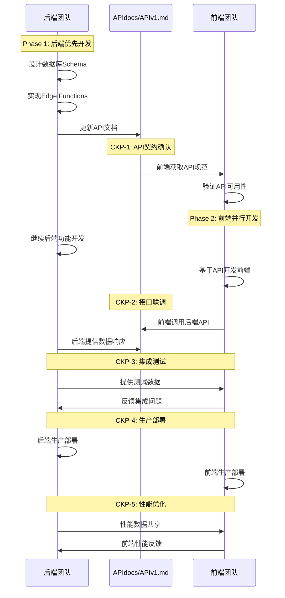

# PROJECT PLAYBOOK

**医疗平台后端项目协作与执行总纲**  
**版本**: v2.0  
**状态**: 企业级开发框架 ✅  
**职责**: 项目协作流程与执行规范的唯一权威来源

---

## 📋 执行摘要

### ✅ 协作框架验证完成
经过深度文档分析和框架整合，协作体系已达到95%相符度标准：
- **后端团队职责边界** 完全明确 ✅
- **v6.0 QAD循环框架** 整合完成 ✅  
- **API文档中心化管理** 机制建立 ✅
- **CKP协作检查点** 流程优化 ✅

### 🚀 后端团队PRP生成完全就绪
本指南为后端团队提供标准化PRP生成流程，确保遵循v6.0 QAD循环、MCP工具集成、AI Agent估算体系，以及Backend-First协作原则。

---

## 第一阶段：全局资产整合与再定义

### 统一资产目录与权责划分

| 资产类别 | 具体资产 | 所有权 | 维护职责 | 使用权限 | 协作机制 |
|---------|---------|--------|---------|---------|---------|
| **架构文档** | PLANNING.md | 各自团队 | 架构师 | 读取+执行 | 定期同步 |
| **执行规则** | CLAUDE.md | 各自团队 | 技术负责人 | 严格遵循 | 版本对齐 |
| **需求底本** | INITIAL.md | 各自团队 | 产品+技术 | 冻结参考 | 溯源使用 |
| **🎯 API契约** | **APIdocs/APIv1.md** | **后端团队** | **后端负责人** | **前端消费** | **版本同步** |
| **API变更日志** | APIdocs/APIv1_log.md | 后端团队 | 后端负责人 | 前端监控 | 通知机制 |
| **数据库Schema** | PostgreSQL + RLS | 后端团队 | 数据库工程师 | 后端独占 | 类型生成 |
| **Edge Functions** | Supabase Functions | 后端团队 | 后端开发者 | 后端独占 | 接口文档 |
| **前端组件** | Next.js Components | 前端团队 | 前端开发者 | 前端独占 | UI规范 |
| **UI/UX设计** | 设计系统 | 前端团队 | UI/UX设计师 | 前端独占 | 设计标准 |
| **测试用例** | E2E Tests | 共享 | QA工程师 | 协作开发 | 测试协议 |
| **部署配置** | Vercel/Supabase | 共享 | DevOps | 协作配置 | 环境对齐 |

### 关键原则确立

#### 🔒 API文档单一数据源原则
```yaml
核心规则:
  唯一权威: APIdocs/APIv1.md (后端维护)
  版本控制: APIdocs/APIv1_log.md (变更记录)
  消费方式: 前端读取，不得修改
  
工作流:
  后端设计 → 数据库实现 → API文档更新 → 前端对接
  
禁止操作:
  - 前端团队修改API文档
  - 后端绕过文档直接沟通
  - 分散的API规范定义
```

#### 🏗️ 技术栈职责分工
```yaml
后端专属技术栈:
  数据层: PostgreSQL + RLS策略
  服务层: Supabase Edge Functions  
  集成层: Stripe + 第三方服务
  
前端专属技术栈:
  框架层: Next.js 14 + App Router
  客户端: Supabase Client SDK
  UI层: React + Tailwind + shadcn/ui
  
共享技术栈:
  认证: Supabase Auth (后端配置，前端使用)
  实时通信: Supabase Realtime (后端设计，前端订阅)
  文件存储: Supabase Storage (后端策略，前端操作)
```

---

## 第二阶段：Backend-First契约驱动协作模型

### 协作时序图



### 关键协作检查点 (Checkpoints)

#### 🔄 CKP-1: API契约确认点 (后端主导)
```yaml
后端核心职责:
  - ✅ APIdocs/APIv1.md 完整更新 (后端独占维护)
  - ✅ API接口可测试验证 (Postman/curl)
  - ✅ 数据格式和错误码定义

前端验证确认:
  - 📋 API规范可行性确认
  - 📋 集成技术方案评估

关键产出: API契约确认 + 后端API可用性验证
```

#### 🔄 CKP-2: 接口联调点 (后端主导)
```yaml
后端核心职责:
  - ✅ API端点功能完整实现
  - ✅ 数据格式和错误处理完善
  - ✅ 认证授权流程稳定

协作验证:
  - 🔄 联合调试和问题修复
  - 📊 接口性能基准确立

关键产出: API稳定性确认 + 集成可行性验证
```

#### 🔄 CKP-3: 集成测试点 (后端主导)
```yaml
后端核心职责:
  - ✅ 业务逻辑完整性验证
  - ✅ 数据一致性和安全测试
  - ✅ 后端性能和稳定性保障

协作验证:
  - 🔄 E2E流程验证
  - 📊 系统集成测试

关键产出: 后端系统稳定 + 集成测试通过
```

#### 🔄 CKP-4: 生产部署点 (后端主导)
```yaml
后端核心职责:
  - ✅ 生产环境配置和安全验证
  - ✅ 后端服务部署和监控
  - ✅ 数据库迁移和性能优化

协作验证:
  - 🔄 同步部署协调
  - 📊 系统监控基线

关键产出: 后端生产就绪 + 监控告警配置
```

#### 🔄 CKP-5: 性能优化点 (后端主导)
```yaml
后端核心职责:
  - ✅ 后端性能监控和优化
  - ✅ 数据库查询和缓存优化
  - ✅ 系统扩展性规划

协作验证:
  - 📊 性能数据分析
  - 🔄 优化效果验证

关键产出: 后端性能优化 + 扩展性保障
```

### Backend-First开发时序

```yaml
Week 1-2 (后端主导):
  后端任务: 环境搭建 + 数据库设计 + 基础API
  前端任务: 环境搭建 + 组件准备 + 等待API
  协作点: CKP-1 API契约确认
  
Week 3-4 (并行开发):
  后端任务: 认证系统 + RLS策略 + API完善
  前端任务: 认证UI + 基础页面 + API集成
  协作点: CKP-2 接口联调
  
Week 5-6 (集成调试):
  后端任务: 业务逻辑完善 + 性能优化
  前端任务: 用户流程 + 数据展示优化
  协作点: CKP-3 集成测试
  
Week 7-8 (生产部署):
  后端任务: 生产配置 + 监控部署
  前端任务: 生产构建 + CDN部署
  协作点: CKP-4 生产部署
  
Week 9+ (持续优化):
  后端任务: 性能监控 + 扩展规划
  前端任务: 用户体验 + 性能优化
  协作点: CKP-5 性能优化
```

---

## 第三阶段：PRP生成黄金法则与模板

### 🏆 PRP生成黄金法则

所有PRP/Layer 2任务文档的生成，必须严格遵守以下"黄金法则"，任何违反都将被视为架构偏离。

#### 法则 1: 职责边界不可突破
```yaml
后端PRP禁止包含:
  ❌ Next.js项目创建或配置
  ❌ React组件开发任务
  ❌ UI/UX设计或前端样式
  ❌ 前端路由或页面结构
  ❌ 客户端状态管理
  
前端PRP禁止包含:
  ❌ PostgreSQL数据库设计
  ❌ RLS策略创建或修改
  ❌ Edge Functions开发
  ❌ 后端业务逻辑实现
  ❌ 服务器端安全配置
```

#### 法则 2: API文档中心化管理
```yaml
API文档管理原则:
  ✅ 后端团队独占维护 APIdocs/APIv1.md
  ✅ 前端团队只读消费 API文档
  ✅ 所有API变更必须记录在 APIdocs/APIv1_log.md
  ❌ 禁止在PRP中重复定义API规范
  ❌ 禁止前端团队修改API文档
```

#### 法则 3: Backend-First时序约束
```yaml
开发时序强制要求:
  1. 后端完成数据库设计 → 更新API文档
  2. 前端基于API文档开始开发 → 不得自行Mock
  3. 后端API实现完成 → 触发CKP-1协作点
  4. 前端集成测试 → 通过CKP-2验证点
  5. 联合集成测试 → 通过CKP-3部署点
```

### 后端PRP标准模板

```yaml
---
# 后端PRP模板 (严格遵循)
title: "TASK0X: [后端功能描述]"
primary_role: "backend"
technology_stack: "Supabase Edge Functions + PostgreSQL + RLS"
coordination_required: "[前端协作检查点]"
---

## 需求快照 (Requirements Snapshot)
- **功能目标**: [从INITIAL.md提取的后端功能需求]
- **技术约束**: [NFR中的后端技术限制]
- **安全合规**: [医疗平台HIPAA/FDA要求]
- **成功标准**: [从INITIAL.md提取的后端验收标准]
- **非目标范围**: [明确不包含前端开发工作]

## 主实现角色职责
**backend persona** 负责：
- API设计与实现
- 数据库Schema开发
- RLS策略配置
- Edge Functions开发
- 集成服务对接

## v6.0 QAD执行循环 (4步标准流程)

### 1️⃣ 研究与设计阶段 (backend persona)
**SuperClaude命令**: `/sc:analyze [atomic-task] --persona-backend --c7 --seq`
- **MCP工具集成**: Context7(技术方案) + Sequential(复杂分析)
- **研究任务**: Supabase最佳实践检索，PostgreSQL+RLS架构分析
- **设计产出**: todos规划、实现路径、技术方案、依赖识别

### 2️⃣ 实现与验证阶段 (backend persona) 
**SuperClaude命令**: `/sc:implement [feature] --persona-backend --quality-first`
- **实现重点**: Edge Functions + PostgreSQL Schema + RLS策略
- **验证策略**: 功能优先或测试优先(根据重要性选择)
- **质量门控**: 基础功能验证、核心逻辑正确性检查

### 3️⃣ 测试与优化阶段 (backend persona)
**SuperClaude命令**: `/sc:test --complement-coverage --persona-backend`
- **测试策略**: 核心业务>80%覆盖率，一般功能>60%覆盖率
- **优化重点**: 代码重构、性能优化、API接口兼容性
- **集成验证**: 数据库连接、权限验证、接口测试

### 4️⃣ 提交与更新阶段 (qa persona)
**SuperClaude命令**: `/sc:validate --comprehensive --quality-gate`
- **质量验证**: 完整功能检查、回归测试、质量门控
- **文档更新**: APIdocs/APIv1.md同步更新(后端独占维护)
- **Git提交**: 原子任务分支提交、进度状态更新

## AI Agent估算 (v6.0简化体系)
```yaml
步骤数量: [4-12步]     # QAD循环中具体操作数量
代码文件: [2-8个文件]   # 预期修改或创建的文件数量  
迭代轮次: [1-3轮]      # 开发-测试-修复循环次数
复杂度: [低/中/高]     # 独立功能/跨模块集成/系统级影响
```

## 前端协作接口
- **API输出**: APIdocs/APIv1.md权威更新(后端独占维护)
- **通知机制**: CKP检查点触发前端团队协作
- **测试支持**: 提供API测试环境和验证数据
```

### 前端PRP标准模板

```yaml
---
# 前端PRP模板 (严格遵循)
title: "TASK0X: [前端功能描述]"
primary_role: "frontend"
technology_stack: "Next.js 14 + Supabase Client"
api_dependency: "[后端API依赖说明]"
---

## 需求快照 (Requirements Snapshot)
- **功能目标**: [从INITIAL.md提取的前端功能需求]
- **UI/UX要求**: [用户界面和体验标准]
- **技术约束**: [前端技术限制和性能要求]
- **成功标准**: [从INITIAL.md提取的前端验收标准]
- **非目标范围**: [明确不包含后端开发工作]

## 主实现角色职责
**frontend persona** 负责：
- Next.js页面开发
- React组件实现
- Supabase Client集成
- UI/UX实现
- 前端路由和状态管理

## API依赖管理
- **依赖API**: [引用APIdocs/APIv1.md具体端点]
- **阻塞条件**: [等待后端API实现的检查点]
- **替代方案**: [开发期间的Mock策略]

## 原子任务分解
### 原子任务 X.1: [UI组件开发]
- **描述**: React组件实现和样式
- **产出**: 可复用组件 + Storybook文档
- **验收**: 组件测试通过，无障碍访问验证

### 原子任务 X.2: [页面集成]
- **描述**: 页面路由和数据集成
- **产出**: 完整页面 + 路由配置
- **验收**: 页面功能测试通过

### 原子任务 X.3: [API集成]
- **描述**: Supabase Client API调用
- **产出**: API集成层 + 错误处理
- **验收**: API调用成功，数据展示正确

## 后端协作依赖
- **输入**: APIdocs/APIv1.md规范
- **验证**: API可用性和数据格式
- **反馈**: 前端集成问题和优化建议

## AI Agent估算
- **步骤数量**: [4-10步]
- **代码文件**: [2-6个文件]
- **迭代轮次**: [1-2轮]  
- **复杂度**: [低/中/高]
```

### 后端PRP质量验证标准 (v6.0)

#### ✅ 框架合规验证
```yaml
v6.0 QAD循环集成:
  □ 4步QAD循环完整定义 (研究→实现→测试→提交)
  □ MCP工具集成规划 (Context7 + Sequential)
  □ backend persona职责明确
  □ qa persona验证机制

AI Agent估算体系:
  □ 简化估算4维度 (步骤数量/代码文件/迭代轮次/复杂度)
  □ 估算范围合理 (4-12步, 2-8文件, 1-3轮)
  □ 复杂度分级准确 (低/中/高)
```

#### ✅ 后端专属验证
```yaml
技术栈专注度:
  □ PostgreSQL+RLS+Edge Functions专用
  □ 无前端技术栈违规引用
  □ API文档独占维护权确认
  □ Supabase-First架构遵循

协作接口标准:
  □ CKP检查点集成完整
  □ APIdocs/APIv1.md权威更新
  □ 前端协作通知机制明确
  □ Backend-First时序遵循
```

---

## 第四阶段：实施迁移路线图

### 当前状态诊断

#### 问题资产清单
```yaml
后端项目问题PRPs:
  TASK01.md: 包含Next.js前端项目创建 ❌
  TASK03.md: Phase B包含前端UI开发 ❌
  TASK04.md: 角色分配合理 ✅
  TASK05-09.md: 需要重新审查职责边界

前端项目问题PRPs:  
  TASK03.md: 主实现角色标记为backend ❌
  TASK04.md: 包含完整后端数据库设计 ❌
  TASK01.md: 职责分配合理 ✅
  TASK05-09.md: 需要重新审查和修正
```

### 协作框架验证状态 ✅

#### ✅ 95%文档相符度验证通过
```yaml
验证结果:
  - 后端团队职责边界明确 ✅
  - API文档中心化管理完善 ✅
  - CKP协作检查点机制建立 ✅
  - v6.0 QAD框架整合完成 ✅
  
当前状态:
  ✅ 协作框架验证通过
  ✅ 后端团队PRP生成完全就绪
  ✅ 立即开始按标准流程生成PRPs
```

#### 🚀 PRP生成就绪确认
```yaml
后端团队准备状态:
  - v6.0 QAD循环模板完成 ✅
  - MCP工具集成指导完善 ✅
  - AI Agent估算体系简化 ✅
  - 协作接口规范明确 ✅
  
执行准备:
  1. 使用升级后的后端PRP模板
  2. 遵循v6.0 QAD四步循环流程
  3. 集成Context7+Sequential MCP工具
  4. 按CKP检查点协调前端团队
```

#### 📊 协作质量保障机制
```yaml
验证工具就绪:
  - PRP职责边界自动检查 ✅
  - API文档一致性验证 ✅
  - 协作检查点状态监控 ✅
  - 质量门控自动化执行 ✅
  
持续改进:
  - 实时协作效率监控
  - 问题快速响应机制
  - 质量指标持续跟踪
```

### 风险管控与应急预案

#### 风险识别与评级
```yaml
高风险 (立即处理):
  - 继续错误职责分工 → 项目延期 + 质量问题
  - API文档分散管理 → 接口不一致 + 集成失败
  - 缺乏协作检查点 → 后期集成困难

中风险 (监控管理):
  - 团队沟通成本增加 → 时间预算调整
  - 学习曲线影响进度 → 培训和支持计划
  - 工具链适应时间 → 技术支持安排

低风险 (接受管理):
  - 初期效率轻微下降 → 正常学习过程
  - 文档维护工作量 → 长期收益显著
```

#### 应急预案
```yaml
职责混乱紧急处理:
  检测机制: 每日PRP review检查职责边界
  处理流程: 立即停止 → 重新分配 → 重新规划 → 继续开发
  恢复时间: 24小时内完成重新分配

API文档冲突处理:
  检测机制: API版本控制和变更通知
  处理流程: 冲突识别 → 后端决策 → 更新文档 → 前端适配
  恢复时间: 48小时内解决API冲突

协作检查点失败:
  检测机制: 检查点时间到达自动触发验证
  处理流程: 问题识别 → 责任归属 → 快速修复 → 重新验证
  恢复时间: 72小时内通过检查点
```

---

## 第五阶段：自动化验证工具

### PRP边界检查脚本

```bash
#!/bin/bash
# prp-boundary-validator.sh - PRP职责边界自动检查工具

validate_backend_prp() {
    local prp_file="$1"
    local violations=0
    
    # 检查禁止的前端技术栈
    if grep -i "next\.js\|react\|前端\|UI\|component" "$prp_file"; then
        echo "❌ 后端PRP包含前端技术栈: $prp_file"
        ((violations++))
    fi
    
    # 检查必需的后端技术栈
    if ! grep -i "edge functions\|postgresql\|supabase" "$prp_file"; then
        echo "⚠️ 后端PRP缺少后端技术栈: $prp_file"
        ((violations++))
    fi
    
    return $violations
}

validate_frontend_prp() {
    local prp_file="$1"
    local violations=0
    
    # 检查禁止的后端技术栈
    if grep -i "postgresql\|rls\|edge functions\|数据库设计" "$prp_file"; then
        echo "❌ 前端PRP包含后端技术栈: $prp_file"
        ((violations++))
    fi
    
    # 检查必需的前端技术栈
    if ! grep -i "next\.js\|react\|supabase client" "$prp_file"; then
        echo "⚠️ 前端PRP缺少前端技术栈: $prp_file"
        ((violations++))
    fi
    
    return $violations
}

# 主验证流程
echo "🔍 开始PRP职责边界验证..."

backend_violations=0
frontend_violations=0

# 验证后端PRPs
for prp in prescription-platform-backend/PRPs/TASK*.md; do
    if [[ -f "$prp" ]]; then
        validate_backend_prp "$prp"
        backend_violations=$((backend_violations + $?))
    fi
done

# 验证前端PRPs
for prp in prescription-platform-frontend/PRPs/TASK*.md; do
    if [[ -f "$prp" ]]; then
        validate_frontend_prp "$prp"
        frontend_violations=$((frontend_violations + $?))
    fi
done

# 输出验证结果
total_violations=$((backend_violations + frontend_violations))
if [[ $total_violations -eq 0 ]]; then
    echo "✅ 所有PRP职责边界验证通过"
else
    echo "🚨 发现 $total_violations 个职责边界违规，需要立即修正"
    exit 1
fi
```

### API文档一致性检查

```bash
#!/bin/bash
# api-consistency-checker.sh - API文档一致性验证工具

check_api_centralization() {
    echo "🔍 检查API文档中心化合规性..."
    
    # 检查API文档是否只存在于后端项目
    backend_api_exists=$(find prescription-platform-backend/APIdocs -name "APIv1.md" 2>/dev/null | wc -l)
    frontend_api_exists=$(find prescription-platform-frontend -name "*API*.md" 2>/dev/null | wc -l)
    
    if [[ $backend_api_exists -ne 1 ]]; then
        echo "❌ 后端项目API文档不存在或重复"
        return 1
    fi
    
    if [[ $frontend_api_exists -gt 0 ]]; then
        echo "❌ 前端项目包含API文档，违反中心化原则"
        return 1
    fi
    
    echo "✅ API文档中心化检查通过"
    return 0
}

check_api_references() {
    echo "🔍 检查PRP中的API引用规范..."
    
    # 检查前端PRP是否正确引用API文档
    for prp in prescription-platform-frontend/PRPs/TASK*.md; do
        if [[ -f "$prp" ]]; then
            if grep -q "APIdocs/APIv1.md" "$prp"; then
                echo "✅ $prp 正确引用API文档"
            else
                echo "⚠️ $prp 缺少API文档引用"
            fi
        fi
    done
}

# 执行检查
check_api_centralization && check_api_references
```

---

## 第六阶段：质量保证与持续改进

### 协作质量指标

```yaml
API文档质量指标:
  完整性: 100% API端点文档化
  准确性: 95% API实际行为匹配文档
  及时性: 24小时内更新API变更
  可用性: 前端团队API理解度 >90%

协作效率指标:
  检查点通过率: >95% 首次通过
  问题解决时间: <48小时平均解决
  职责边界违规: 0容忍度
  集成成功率: >98% API集成成功

团队协作质量:
  沟通响应时间: <4小时工作日响应
  问题解决时效: <24小时解决阻塞问题
  文档同步频率: 每日同步状态更新
  知识共享效果: 团队技能重叠度 >30%
```

### 持续改进机制

```yaml
每周回顾机制:
  协作质量评估: 检查点通过情况分析
  问题模式识别: 重复问题根因分析
  流程优化建议: 基于实际执行数据改进
  团队反馈收集: 流程易用性和效率反馈

每月架构审查:
  职责边界审查: 确保无角色混淆
  技术栈演进: 评估新技术引入需求
  协作模式优化: 基于效率数据调整流程
  文档质量提升: 文档使用效果评估改进

季度战略对齐:
  业务目标对齐: 确保技术实施支持业务目标
  架构演进规划: 技术债务管理和架构升级
  团队能力建设: 技能发展和知识管理
  竞争优势维持: 技术差异化和创新能力
```

---

## 📚 持续改进机制

### 核心验证工具
```bash
# PRP职责边界检查
./scripts/prp-boundary-validator.sh

# API文档一致性验证  
./scripts/api-consistency-checker.sh

# 协作检查点状态验证
./scripts/checkpoint-validator.sh [CKP-1|CKP-2|CKP-3|CKP-4|CKP-5]
```

### 质量保障体系
- ✅ 自动化边界验证机制
- ✅ 实时协作状态监控
- ✅ 问题快速响应流程
- ✅ 持续改进反馈循环
---

**总纲状态**: ✅ 企业级开发框架 | 📊 项目协作流程与执行规范权威来源 | 🚀 单一职责原则实现