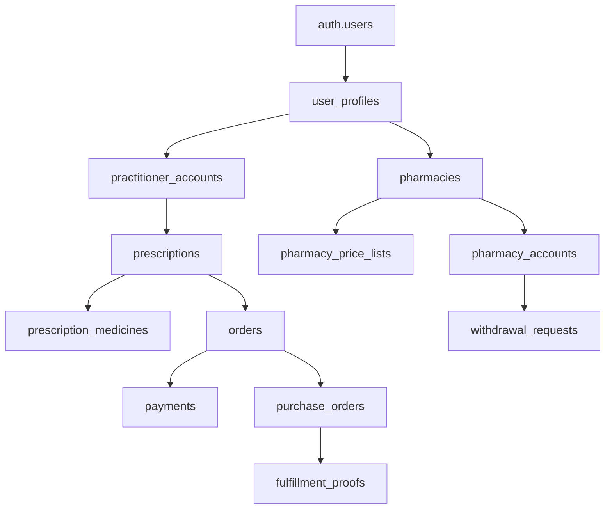

# INITIAL.md - B2B2C中医处方履约平台

## 🔄 冻结与溯源声明

**需求底本角色**: 本文件作为项目需求底本。PRP生成后，作为"前置底本"冻结，仅用于溯源与再生成。
**执行依据**: 执行阶段以"当前PRP（含Requirements Snapshot）"与`APIdocs/APIv1.md`为准。
**变更管理**: 需求变更通过新PRP版本（PRPs/<feature>_vN.md）表达，并在Delta段注明变化与影响。

## 🎯 后端开发项目全局描述

**本项目严格专注于后端系统开发**：API设计实现、数据库架构、业务逻辑、服务器端功能开发

**🚨 项目边界声明**:
- **专注领域**: 后端服务开发 (Supabase Edge Functions + PostgreSQL + RLS)
- **排除领域**: 前端界面开发、用户交互设计、客户端逻辑
- **协作界面**: 提供完整API接口和数据格式规范供前端团队对接

### 后端责任范围 (明确边界)
- **API开发**: Supabase Edge Functions实现、RESTful接口设计、业务逻辑处理
- **数据库设计**: PostgreSQL Schema设计、RLS策略实现、数据迁移管理
- **集成服务**: 支付网关集成、Supabase Auth配置、第三方服务对接
- **数据处理**: 财务计算引擎、处方管理工作流、审核业务逻辑

### 🚨 API文档中心化管理
**APIv1.md单一数据源强制原则**：
- **主文档**: `APIdocs/APIv1.md` - 项目唯一API权威文档，所有前后端开发必须遵循
- **版本日志**: `APIdocs/APIv1_log.md` - API变更历史、兼容性说明、断版通知的完整记录
- **接口契约**: 与前端团队的接口约定、数据格式规范、错误码定义集中管理

**API开发严格工作流**：
```
🎯 业务需求 → 🏗️ 后端功能设计 → 🗄️ Supabase数据库设计 → 📄 APIv1.md更新 → 🔄 前端对接
```

**修改方向不可逆转**：
- ✅ 后端功能设计驱动数据库设计，再驱动API文档更新
- ❌ 禁止因API文档变更而修改已设计的后端和数据库结构

### 项目愿景
构建**安全、合规、高效**的B2B2C中医处方数字化履约平台，连接医师、药房和患者，实现处方数字化流转和精准履约，提升中医药服务的可及性和标准化水平。

### 目标用户群体
- **医师端** (Primary): 中医执业医师，需要数字化处方管理和收益追踪
- **药房端** (Primary): 中药房经营者，需要高效履约和库存管理
- **管理端** (Internal): 平台管理员，负责审核、风控和运营分析

### 核心价值主张
1. **医师价值**: 数字化处方管理 + 透明收益结算 + 专业声誉建设
2. **药房价值**: 精准订单获取 + 标准化履约流程 + 稳定现金流
3. **平台价值**: 交易撮合费用 + 数据洞察服务 + 质量认证体系

### 商业模式
**收益公式**: `basePrice(医师定价) - pharmacyPrice(药房成本) = 平台收益`
- **医师收益**: 处方费用 - 平台服务费 = 净收入
- **药房收益**: 药材销售利润 + 履约服务费 = 总收益  
- **平台收益**: 交易差价 + 增值服务费 = 平台利润

## 🏗️ 技术架构概览

### 技术栈选型理由

#### Supabase优先架构 (强制要求)
**选择原因**:
- **全栈集成**: Database + Auth + Real-time + Storage一体化解决方案
- **开发效率**: 减少70%基础设施代码，专注业务逻辑开发
- **扩展性**: PostgreSQL企业级数据库，支持复杂查询和高并发
- **安全性**: 内置Row Level Security，数据库层权限控制

**技术组件**:
```
⚠️ Frontend Layer: Vercel Next.js 14 + Supabase Client (历史参考，当前项目不涉及)
│
├── 🎯 Supabase Layer: PostgreSQL + GoTrue Auth + RLS + Realtime (本项目核心)
│   ├── Database: 处方数据、用户管理、财务记录 (localhost:54321)
│   ├── Auth: 医师/药房/管理员角色认证
│   ├── RLS: 数据权限隔离和访问控制
│   └── Storage: QR码、履约凭证、处方附件
│
└── 🎯 Backend Layer: Edge Functions (复杂业务逻辑) (本项目专注领域)
    ├── 财务计算引擎 (NZD精确计算)
    ├── 处方状态机控制
    ├── 支付集成 (Stripe)
    └── 审核工作流管理

📋 说明: 前端层面描述仅作为API接口设计参考，实际开发专注于Supabase + Edge Functions
```

### 🌐 本地开发环境端口架构

**端口分配策略** (开发环境强制规范):
- **前端服务**: `3000-3009` 端口范围 (支持多开发者并行)
- **后端服务**: `4000` 默认端口 (本地补充服务)
- **Supabase本地**: API(54321), PostgreSQL(54322), Studio(54323)

**跨域访问**: 开发环境支持localhost:3000-3009多端口访问

#### 集成服务选择
- **支付处理**: Stripe (国际标准、安全合规、费率透明)
- **部署平台**: Vercel (Next.js原生支持、全球CDN、自动扩展)
- **监控告警**: Supabase Analytics + Vercel Analytics (开发运维一体化)
- **邮件服务**: Supabase Email (统一服务提供商，简化配置)

### 数据架构概览

#### 核心实体关系


#### 隐私合规设计
**🚨 关键原则**: 处方平台不存储患者个人信息
- **符合GDPR**: 无个人身份信息收集和处理
- **符合HIPAA**: 医疗信息匿名化处理
- **符合本地法规**: 遵循目标市场隐私保护要求

#### 财务数据精度
**NZD Cents精确计算**:
- **存储格式**: INTEGER类型存储cents，避免浮点误差
- **计算引擎**: Decimal.js精确计算，银行级精度标准
- **审计要求**: 所有财务操作完整审计日志

## 📋 开发阶段划分与里程碑

### 第一阶段: 基础架构搭建 (Week 1-2)
**里程碑**: 开发环境就绪，核心数据模型完成
- **TASK01**: 开发环境配置和工具链验证
- **TASK02**: Supabase项目初始化和数据库设计
- **验收标准**: 本地开发环境完整运行，数据库迁移成功

### 第二阶段: 认证授权系统 (Week 3-4)  
**里程碑**: 用户认证流程完成，权限控制生效
- **TASK03**: Supabase Auth集成和角色管理
- **TASK04**: RLS策略实现和权限验证
- **验收标准**: 医师/药房/管理员角色隔离，数据安全访问

### 第三阶段: 核心业务功能 (Week 5-8)
**里程碑**: 处方完整生命周期实现
- **TASK05**: 处方创建和管理系统
- **TASK06**: 支付集成和财务计算
- **TASK07**: QR码生成和药房履约
- **验收标准**: 端到端业务流程可操作，计算精度验证

### 第四阶段: 管理审核系统 (Week 9-10)
**里程碑**: 管理员工作台和审核流程
- **TASK08**: 管理员审核工作流
- **TASK09**: 财务结算和批量提现
- **验收标准**: 管理功能完整，财务数据准确

### 第五阶段: 集成测试优化 (Week 11-12)
**里程碑**: 生产环境部署就绪
- **性能优化**: 数据库查询优化，缓存策略实施
- **安全测试**: 渗透测试，权限验证，数据泄露防护
- **用户验收**: 真实场景测试，用户体验优化

## 🗂️ 任务树索引系统 - 中央进度追踪中心

## 🏗️ 三层任务树协作架构 (核心方法论)

### 架构设计理念
采用分层解耦的任务管理模式，实现从战略规划到代码执行的完整链路：

#### Layer1: 战略Feature层 (PLANNING.md)
- **职责范围**: 业务价值定义、技术架构决策、质量门控标准
- **负责角色**: 架构师(人工)
- **更新频率**: 项目初期制定，相对稳定
- **典型周期**: 项目启动阶段完成，迭代时微调

#### Layer2: 战术Phase层 (PRPs/TASK0X.md)
- **职责范围**: 具体功能分解、接口契约定义、Phase级验收标准
- **负责角色**: 架构师(人工) + SuperClaude工具建议
- **更新频率**: 每个功能模块开发前制定，开发中微调
- **典型周期**: 1-2周迭代，每个TASK独立管理

#### Layer3: 执行Atomic层 (Agent自主生成) - v6.0框架
- **职责范围**: 原子任务执行、3+1步骤循环、代码实现
- **负责角色**: AI Coding Agent完全自主
- **更新频率**: 实时生成和执行，动态状态管理
- **典型周期**: 数小时完成，使用TodoWrite工具追踪
- **执行模式**: 3+1统一循环 (需求分析与设计 → 实现与自测 → 集成准备 → 质量验证与提交)
- **估算体系**: AI Agent简化估算 (步骤数量、代码文件、迭代轮次、复杂度)

### 层间协作机制
- **Layer1→Layer2**: 架构师基于战略规划分解出具体TASK
- **Layer2→Layer3**: Agent读取Phase描述，自动生成TDD-Todos并执行
- **反向追溯**: 支持从Layer3代码变更向上同步到Layer2状态

### 📊 三层任务树完整导航

**Layer1 → Layer2 → Layer3 完整映射关系**

```
PLANNING.md (Layer1 战略规划)
├── 🎯 后端开发责任范围定义
├── 📋 API文档中心化策略  
├── 🏗️ Supabase优先架构设计
└── 🚀 九阶段开发路线图
    ↓
PRPs/TASK0X.md (Layer2 战术实施)
├── TASK01.md - 环境配置和验证 ✅ 🔄同步点A
├── TASK02.md - 数据库设计和RLS ⏳ 🔄同步点B  
├── TASK03.md - Supabase Auth集成 📋 🔄同步点C
├── TASK04.md - RLS策略和权限控制 📋
├── TASK05.md - 处方管理核心系统 📋 🔄同步点D
├── TASK06.md - 支付和财务计算 📋 🔄同步点E
├── TASK07.md - QR码和药房履约 📋 🔄同步点F
├── TASK08.md - 管理员审核工作流 📋 🔄同步点G
└── TASK09.md - 财务结算和提现 📋 🔄同步点H
    ↓
Atomic Tasks (Layer3 执行单元 - 运行时生成)
├── TDD-Todos 9步开发循环 (详见CLAUDE.md)
├── 4-8小时可完成的原子任务
└── 实时进度状态同步到Layer2
```

### 🔄 前后端协作同步节点

**后端开发主线与前端对齐标识**：
- 🔄 **同步点A**: 开发环境统一配置完成 (TASK01完成后)
- 🔄 **同步点B**: 数据模型确认和TypeScript类型同步 (TASK02完成后)
- 🔄 **同步点C**: 认证流程和权限验证联调 (TASK03-04完成后)
- 🔄 **同步点D**: 处方数据接口确认和实时状态同步 (TASK05完成后)
- 🔄 **同步点E**: 支付流程集成和财务数据展示 (TASK06完成后)
- 🔄 **同步点F**: 药房履约界面和订单状态实时更新 (TASK07完成后)
- 🔄 **同步点G**: 管理员界面数据联调和审核流程集成 (TASK08完成后)
- 🔄 **同步点H**: 财务报表界面和提现流程前后端集成 (TASK09完成后)

### 📈 进度状态追踪系统

**状态标识说明**：
- ✅ **已完成** - 功能开发完成，测试通过
- ⏳ **进行中** - 当前正在开发
- 📋 **计划中** - 已规划但未开始
- 🔄 **同步点** - 需要与前端团队对齐的关键节点

**当前开发状态** (实时更新)：
- **整体进度**: Layer1规划完成 ✅，Layer2规划进行中 ⏳
- **当前焦点**: TASK01环境配置和工具链验证 ⏳
- **下一里程碑**: 开发环境完整配置完成 🔄同步点A
- **团队协作**: 等待前端团队环境配置完成后进行对齐

### 🎯 任务树导航使用指南

**Agent任务执行导航流程**：
1. **接收任务** → 检查INITIAL.md当前状态定位
2. **确认层级** → 识别是Layer1、Layer2还是Layer3任务
3. **找到上下文** → 通过任务树索引找到相关文档
4. **执行任务** → 按照TDD-Todos循环完成开发
5. **更新状态** → 完成后更新INITIAL.md进度状态
6. **同步检查** → 如果是同步点，通知前端团队对齐

**快速定位指令**：
- 查看总体规划：`阅读 PLANNING.md`
- 查看具体任务：`阅读 PRPs/TASK0X.md`
- 查看API文档：`阅读 ~/APIdocs/APIv1.md`
- 更新进度：`更新 INITIAL.md 状态标识`

### Layer3 自动生成规则

#### v6.0框架TDD-Todos循环触发条件
- **输入**: TASK文档中的"最小单位任务列表"
- **粒度**: 可完成的原子任务 (v6.0简化)
- **输出**: 3+1统一步骤循环，包含设计、实现、集成、验证
- **状态同步**: 每个原子任务完成后自动更新进度
- **轻量级验证**: 基础质量检查，保持核心验证能力

#### SuperClaude工具集成指引
- **任务标注要求**: 生成TASK0X.md时，每个任务标注推荐的SuperClaude命令(/implement, /build, /analyze等)、角色(--persona-backend等)和MCP服务器
- **工具选择**: 选择最适合的工具组合，确保开发效率最大化

#### 示例: TASK05处方创建 → Layer3任务
```
Layer3任务1: 处方数据模型定义 ✅
- 编写TypeScript类型定义
- 创建Zod验证模式  
- 设计数据库表结构
- 单元测试覆盖边界条件
🔄 API接口确认：与前端确认处方数据结构

Layer3任务2: 处方创建API ⏳
- Supabase Edge Function实现
- RLS策略权限验证
- 业务规则校验逻辑
- 集成测试和错误处理

Layer3任务3: 处方管理界面后端支持 📋
- 处方列表查询API
- 实时状态变更推送
- 处方状态转换验证
- 性能优化和缓存策略
🔄 前后端集成：实时数据绑定和状态同步验证
```

## 📖 当前任务定位和下一步行动

### 当前后端开发状态
**阶段**: 项目配置和架构设计阶段
**进度**: Layer1架构文档完成 ✅，Layer2任务规划进行中 ⏳
**当前焦点**: TASK01环境配置和工具链验证 ⏳
**下一里程碑**: 开发环境完整配置完成 🔄同步点A
**API文档状态**: APIv1.md已完成，作为全项目唯一API规范源，待后端实现同步

### 下一步行动指引

#### 立即执行 (今日内完成)
1. **完成TASK01实施**: 创建TASK01.md并开始环境配置
2. **遵循API文档规范**: 严格按照APIv1.md定义实现所有接口
3. **验证开发工具链**: 确认SuperClaude工具链可用性
4. **同步前端进度**: 与前端团队确认环境配置同步计划

#### 本周计划 (Week 1)
1. **完成TASK01-02**: 环境配置 + 数据库设计
2. **完全按APIv1.md实现**: 所有API端点完全遵循文档规范，确保100%一致性
3. **建立开发流程**: Git工作流 + CI/CD配置  
4. **团队协作规范**: 代码审查 + 任务分配机制
5. **前后端对齐**: 确保🔄同步点A-B按计划执行

#### 技术验证检查点
- [ ] Node.js 18+, Supabase CLI, Vercel CLI安装验证
- [ ] Supabase项目创建和本地开发环境连接 (localhost:54321)
- [ ] Next.js项目初始化和TypeScript配置 (localhost:3000)
- [ ] 基础数据库Schema设计和迁移测试
- [ ] 第一个Edge Function部署成功
- [ ] 前后端跨域访问配置验证 (3000↔54321)
- [ ] 多端口开发环境配置测试 (3000-3009)
- [ ] 本地后端服务集成测试 (localhost:4000)

## 📚 Examples目录索引和使用说明

### 可复用代码模式索引

#### 核心业务逻辑模式
```
examples/
├── business-logic/
│   ├── prescription-calculator.service.ts # 处方计算引擎 (90%复用)
│   ├── stripe-payment.service.ts         # Stripe支付集成 (85%复用)
│   └── qr-generator.service.ts           # QR码生成服务 (95%复用)
│
├── supabase-patterns/
│   ├── supabase-rls-policies.sql         # Row Level Security策略 (100%复用)
│   ├── rls-policy-generator.ts           # RLS策略生成工具 (85%复用)
│   └── type-sync-generator.ts            # TypeScript类型同步 (90%复用)
│
└── database-schemas/
    └── supabase-complete-schema.sql      # 完整数据库架构 (100%复用)
```

### 核心服务复用价值
**65%代码资产复用**: 包含QR码生成、处方计算引擎、Stripe支付、审计日志等核心服务 (考虑架构转换)
**质量保障**: ~43,750 LOC可参考，预估节省4-6个月开发工作量 (业务逻辑保留75%)

## 🔄 开发流程和质量保证

### 质量门控标准
- **代码质量**: ESLint + Prettier + TypeScript严格模式
- **测试覆盖**: 单元测试>80%，E2E测试完整性
- **性能指标**: API响应P95<500ms，页面加载<3s
- **安全标准**: RLS策略覆盖，零高危漏洞

### Git工作流规范 (v6.0三层分支策略)
- **分支策略**: 三层映射 (main/TASK-YYYY-MM/YYYY-MM-DD-HHMM-<identifier>)
- **提交规范**: Conventional Commits格式 + 3+1步骤循环集成
- **质量门控**: 轻量级验证 + 医疗合规检查自动触发
- **分支管理**: 11个分支限制 + 自动清理机制

## 如何用于生成PRP (提示)

**推荐方式**: 为每个特性在`PRPs/`下创建独立的INITIAL文件（如`PRPs/INITIAL-<feature>.md`），以便精确生成对应PRP。

**生成命令示例**: `/generate-prp PRPs/INITIAL-<feature>.md`
**执行命令示例**: `/execute-prp PRPs/<feature>_vN.md`

## 参考链接 (仅指针，不复制内容)

### API真源与变更
- **APIdocs/APIv1.md**
- **APIdocs/APIv1_log.md**

### 战略与门槛
- **PLANNING.md** (战略/路线/门槛/风险)

### 执行规则
- **CLAUDE.md** (阶段白名单、校验门、变更流程)

### 任务与实现
- **PRPs/** (当前执行PRP与历史版本)
- **examples/** (脚手架与模式)

### 历史参考 (择要阅读)
- **prd-reverse-engineering/old_docs/** (阶段白名单、NFR/KPI、Checkpoint)

---

**项目配置完成标识**: ✅ **需求底本角色** | 📊 **项目概览完整性** | 🔗 **PRP生成就绪** | 🚀 **冻结状态**: PRP生成后冻结

*本INITIAL.md增加"冻结与溯源"使用提示与引用指针，作为项目需求底本使用*